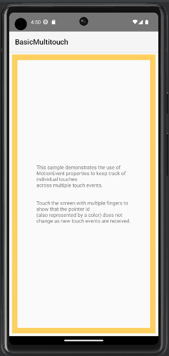
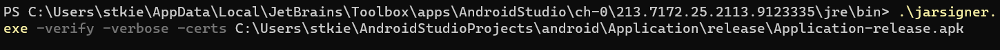
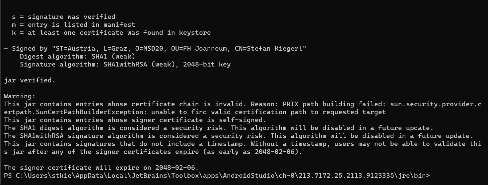
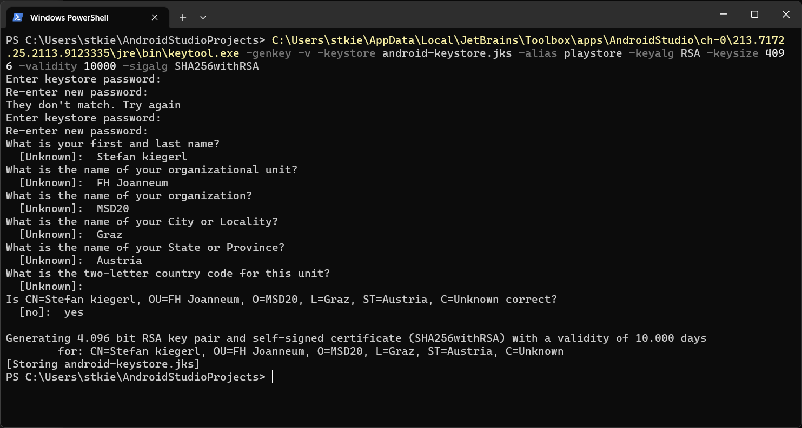
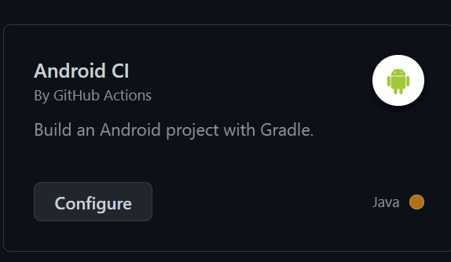
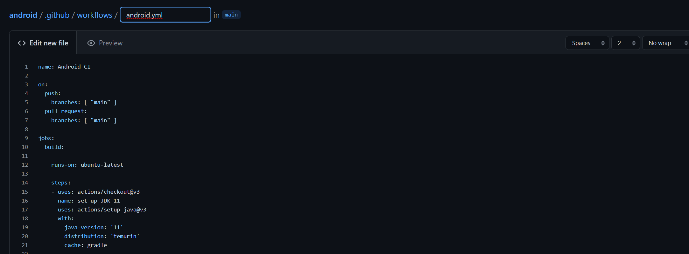

# Android CI/CD

## Part 1
1. Start the basic multitouch application in an emulator\

2. Create a keystore and sign the apk

3. Check the apk\

4. Create a new keystore\

## Part 2
1. Pushe das Repo auf GitHub
2. Erstelle einen neuen Workflow\

